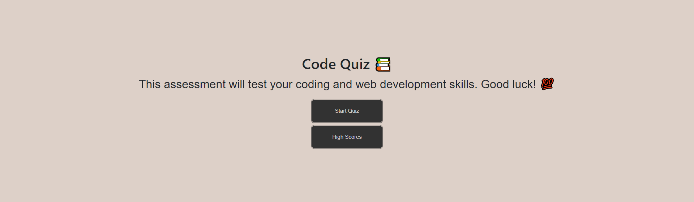

# Code Quiz

M4 - This repo is a Code Quiz application. It is a timed, multiple-choice quiz for users to test their coding knowledge.

## Description

The challenge is an Job-seeking coding assessment or take-home assignment (no starter code is provided, we will build this web application by scratch). The goal is to create an application of a timed coding quiz with multiple-choice questions. This app will run in the browser and will feature dynamically updated HTML and CSS powered by JavaScript code and the use of Web APIs. It will have a clean, polished, and responsive user interface.

The motivation behind this project was to learn how to utilize all the previous skills we have learned as well as the utilization of Web APIs we've been learning. I built this project in order to hone my own skills in HTML, CSS, Git, JavaScript and Web APIs. The problem it solved is creating a timed coding quiz application to work on the coding skills I've learned in the bootcamp thus far.

## Accessing the Repo or Webpage:

- GitHub Repo URL: https://github.com/kevindimayuga/code-quiz-kd
- GitHub Pages WebPage Deployment URL: https://kevindimayuga.github.io/code-quiz-kd/

## Webpage Screenshot



## Table of Contents

- [Installation](#installation)
- [Usage](#usage)
- [Credits](#credits)
- [License](#license)
- [Badges](#badges)
- [Features](#features)
- [Contributions](#contributions)
- [Tests](#tests)
- [Contacts](#Contacts)

## Installation

The following steps were taken to complete the project:
- Review the purpose of the project, the user story and acceptance criteria
- Review the basics to starting a web application
- Review semantic HTML elements and structure
- Review CSS and advanced CSS
- Review JavaScript
- Review Web APIs
- Review code accessibility standards
- Create Professional README file
- Add website image/gif to README file
- Deploy website to GitHub Pages
- Submit URLs to deployed webpage and GitHub Repo

HTML Updates
```
<!-- comments were made as needed in the HTML file -->
```

CSS Updates
```
/* comments were made as needed in the CSS file */
```

JavaScript Updates
```
// comments were made as needed in the JavaScript file
```

Web APIs Updates
```
// comments were made as needed in the HTML and JavaScript file
```

## Usage

- Go to the Code Quiz web application
- Begin the Code Quiz by clicking the "Start Quiz" button
- Go through each multiple choice question by selecting an answer (ideally the correct one)
- It will notify you if you are "correct" or "incorrect" after selecting each answer
- After you complete the questions, you will be given a final score on how well you did
- Enter initials and click "Submit Score" to add high score to high score leaderboard
- View all high scores
- Click either the "Play Again" button to take the quiz again or "Clear Highscores" to clear all previous scores from the leaderboard

## Credits

I used the following resources to help guide me to complete the portfolio project:

- [How to take a full page screenshot with a hidden Chrome shortcut](https://zapier.com/blog/full-page-screenshots-in-chrome/)
- [JavaScript Tutorial](https://www.w3schools.com/js/)
- [CSS and JavaScript accessibility best practices](https://developer.mozilla.org/en-US/docs/Learn/Accessibility/CSS_and_JavaScript)
- [Window prompt()](https://www.w3schools.com/jsref/met_win_prompt.asp)
- [JavaScript While Loop](https://www.w3schools.com/js/js_loop_while.asp)
- [JavaScript if, else, and else if](https://www.w3schools.com/js/js_if_else.asp)
- [JavaScript For Loop](https://www.w3schools.com/js/js_loop_for.asp)
- [Web APIs](https://developer.mozilla.org/en-US/docs/Web/API)

## License

N/A

## Badges

N/A

## Features

N/A

## Contributions

N/A

## Tests

N/A

## Contacts

- GitHub: [kevindimayuga](https://github.com/kevindimayuga)
- Email: k.dimayuga22@gmail.com